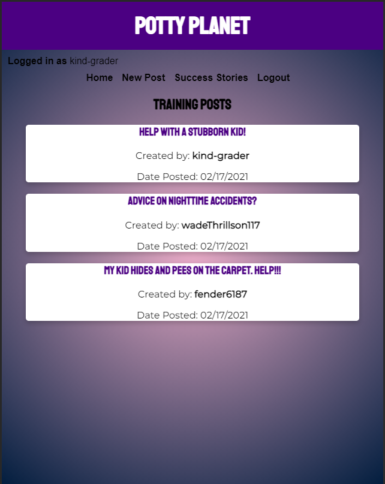
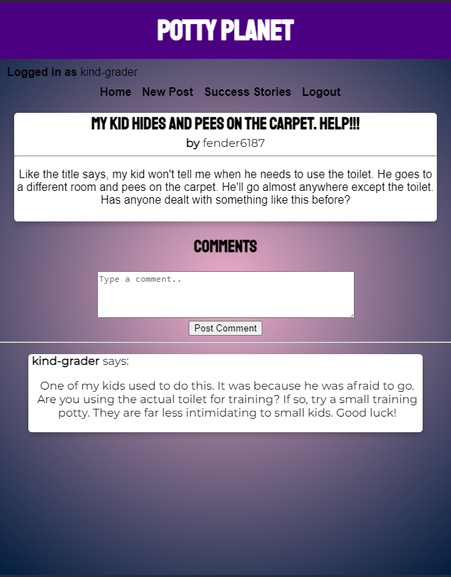
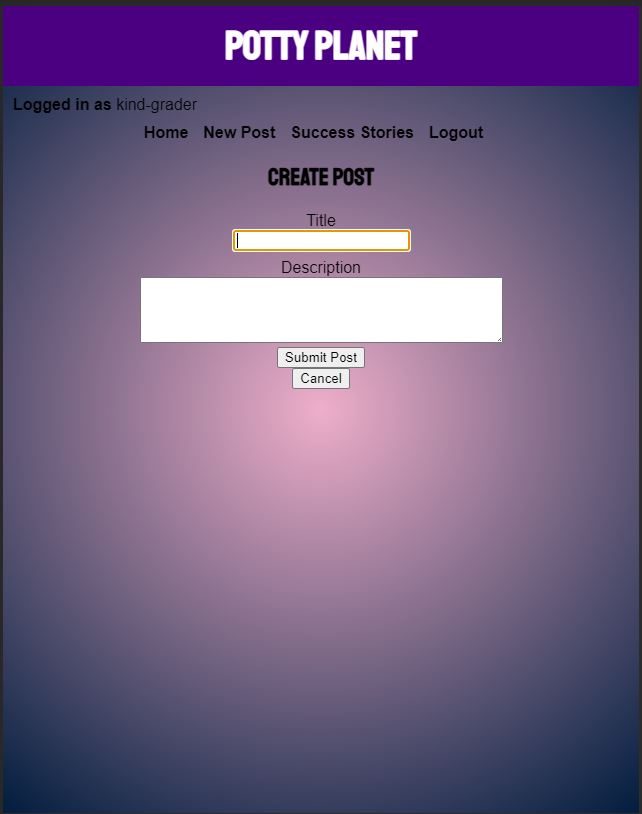
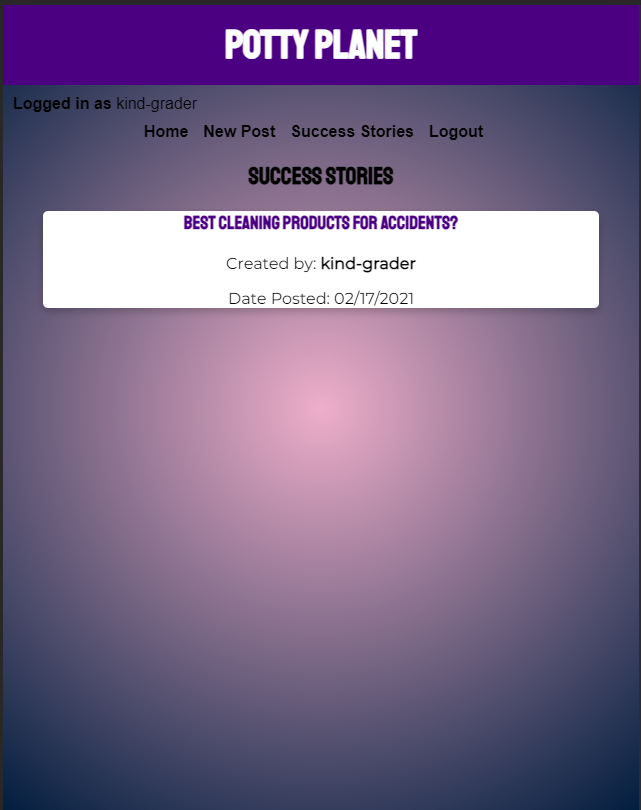
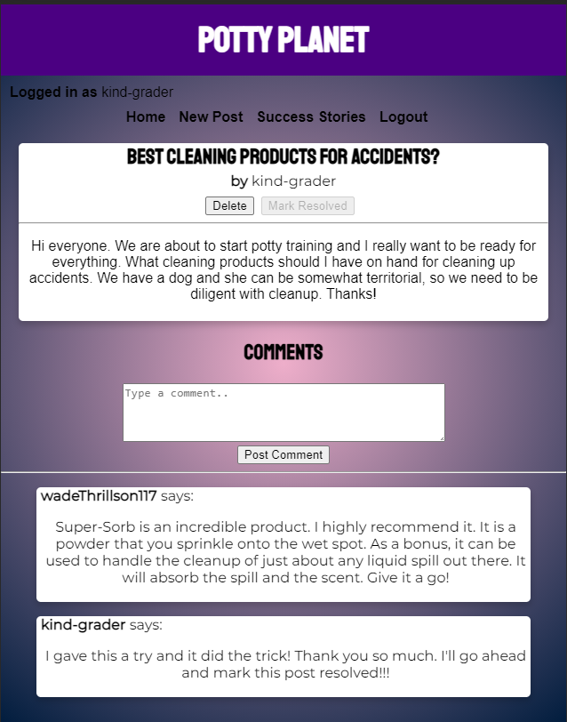
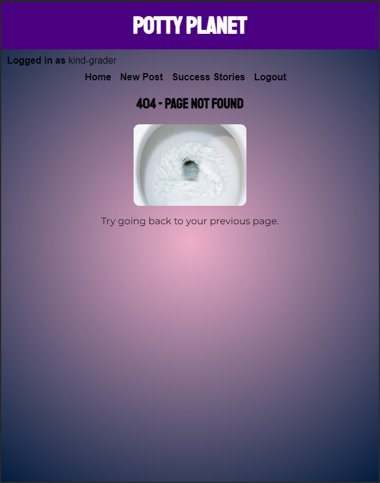

# Map Mash Client

https://potty-planet-client.vercel.app

## Description

This is the Potty Planet Client, which is an application that allows users to create and view posts about their potty training experiences. Every kid is different, sometimes it takes outside experience to help you on your way to getting your child potty trained.

Upon registering and logging in, the user will be taken to the homepage where they will see unresolved posts. These are posts parents have created because they need help or suggestions related to their potty training problems. Any user may comment to make their suggestion. The user may also create a post entering a title and optional content detailing their potty training issue. Upon submitting a post, the user will be pushed to the home page where they will see their new post. Once your issue has been resolved and your kid uses the potty, the user may click a button to resolve their post. This will archive the post to the Success Stories route. This let's other parents know how you solved your potty training issue. A user may also delete their post. The resolve and delete buttons are conditionally rendered to show when the post user id matches the id of the user who is logged in.

All posts rendered in the Success Stories route may still take comments. However the resolve button is disabled. If the user tries to navigate to a route or post that does not exist, they will be rerouted to a 404 page.

Potty Planet is a PERN application, cosisting of PostgreSQL, Express, React and Node.js.

